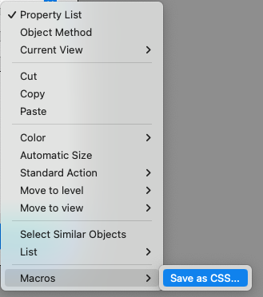
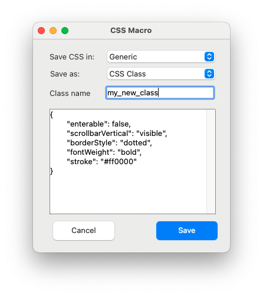

# Form Macro - Save CSS

## Introduction

CSS is a complex, very powerful feature.

It allows to assign several styles to a single object(=cascaded).
It allows to select object based on class name, object name or object type or attribute - and that in any combination.

See [documentation](https://developer.4d.com/docs/FormEditor/stylesheets#class) "Specific attributes" for examples

But you might want to use it also as simple style assignment.
Such as "red, bold, 14 point font" for important text.

This form macro allows easily to create this kind of (simple) styles.

## Usage

Assign using property list all attributes you want to assign, such as color, font style, multi line, styled text, scrollbar display or any other attribute, to an object.

Then right click that object, and use the Macros->Save as CSS menu to open a window.

In the dialog, choose to save as generic CSS or assigned to Mac/Windows.
The 2nd popup allows to choose to save it as CSS class name - or for similar types (such as buttons, check box, input, etc) or for all objects with same object name.

The preview area shows which attributes are included.

Finally click Save.

## Installation

Copy from this structure into your structure:
- class "SaveCSS"
- project form "CSS_Macro"
- file "FormMacros.json" (same level as Classes or Forms folder)
- Restart your 4D...